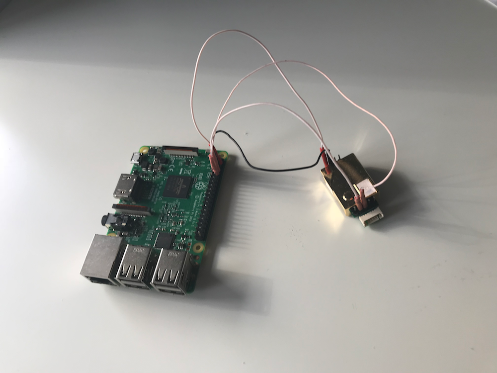
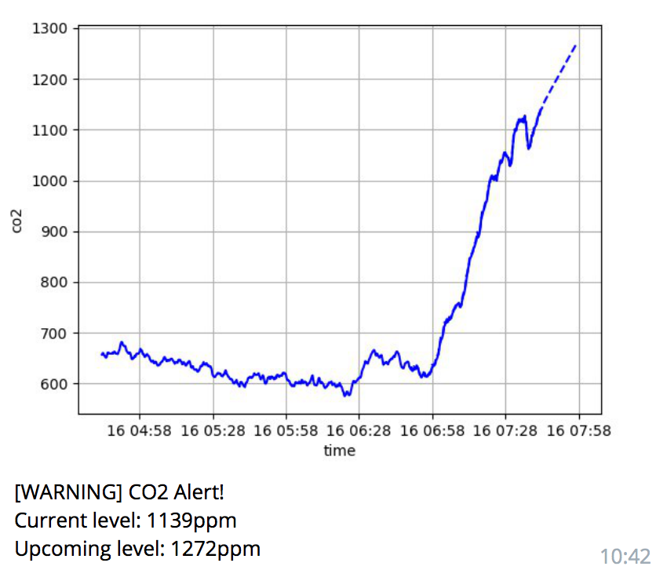
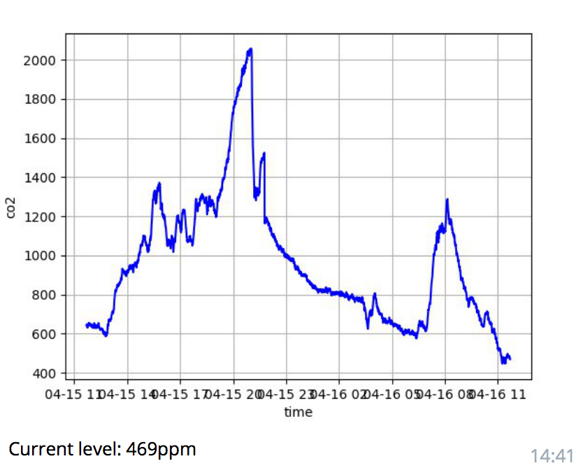

class: center, middle

# AirMon
## Keep track of the air quality around you

---
class: center, middle

# Vitalii Vokhmin
##  [vit-](https://github.com/vit-)

---
# What?

- Monitor CO<sub>2</sub> level
- Be notified when the level increases
- See statistics

---
# Why?

- Sleepiness
- Poor concentration
- Headaches
- Increased heart rate


- Brain damage
- Coma
- Death

---
# CO<sub>2</sub> levels

|       |          |
| -------: | -------- |
| 450      | Normal background concentration in outdoor ambient air |
| 1,000    | Concentrations typical of occupied indoor spaces with good air exchange |
| 2,000    | Complaints of drowsiness and poor air |
| 5,000    | Headaches, sleepiness and stagnant, stale, stuffy air. Poor concentration, loss of attention, increased heart rate and slight nausea may also be present |
| >5,000   | Workplace exposure limit (as 8-hour TWA) in most jurisdictions |
| >40,000  | Exposure may lead to serious oxygen deprivation resulting in permanent brain damage, coma, even death |

---
# How?

- Raspberry PI
- MH-Z19 CO<sub>2</sub> sensor



---
# Measurements

```python
import serial

def mh_z19():
    cmd = bytearray([0xFF, 0x01, 0x86, 0x00, 0x00, 0x00, 0x00, 0x00, 0x79])
    with serial.Serial('/dev/serial0', baudrate=9600) as ser:
        while True:
            ser.write(cmd)
            result = ser.read(9)
            if result:
                checksum = 0xFF - (sum(result[1:8]) % 256) + 0x01
                if checksum == result[8]:
                    value = result[2] * 256 + result[3]
                    yield value
```

---
# Forecast

```python
import pandas as pd

def get_train_data():
    # read the data from DB/storage
    lookback_date = datetime.utcnow() - timedelta(hours=1)
    levels = ((l.timestamp, l.value) for l in get_co2_levels_from_db(date_from))
    timestamps, values = list(zip(*levels))

    data = pd.Series(values, index=timestamps)  # create pandas Series
    data = data.resample('10s').mean()          # resample the data
    data = data.interpolate()                   # fill the gaps
    return data
```

---
# Forecast (cont)

```pyhton
from statsmodels.tsa.ar_model import AR

def predict():
    data = get_train_data()
    model = AR(data)
    model_fit = model.fit()

    prediction_time = lookback_date = datetime.utcnow() - timedelta(minutes=15)
    predictions = model_fit.predict(end=prediction_time)
    return predictions
```

---
# Plot charts

```python
from io import BytesIO
from matplotlib import pyplot

def draw_png(data, predictions):
    pyplot.plot(data, color='blue')
    pyplot.plot(predictions, color='blue', linestyle='dashed')
    pyplot.xlabel('time')
    pyplot.ylabel('co2')
    pyplot.grid(True)

    img = BytesIO()
    pyplot.savefig(img, format='png')
    pyplot.clf()
    img.seek(0)
    return img
```

---
# Charts

.pull-left[Alert example] .pull-right[24h stats]
.pull-left[

] .pull-right[

]


---
# Conclusions

- CO<sub>2</sub> level changes pretty rapidly
- Air quality is actually worse then I expected

###  [vit-/pi-airmon](https://github.com/vit-/pi-airmon)
